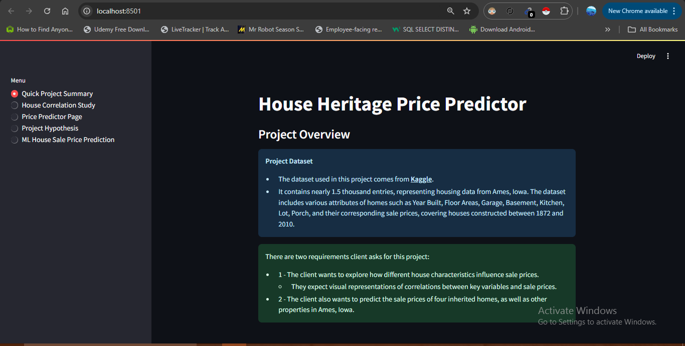
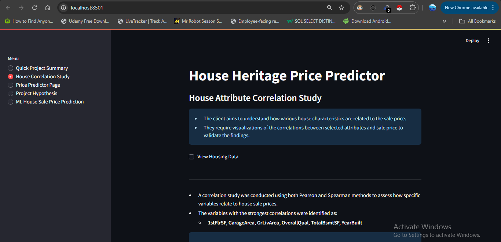
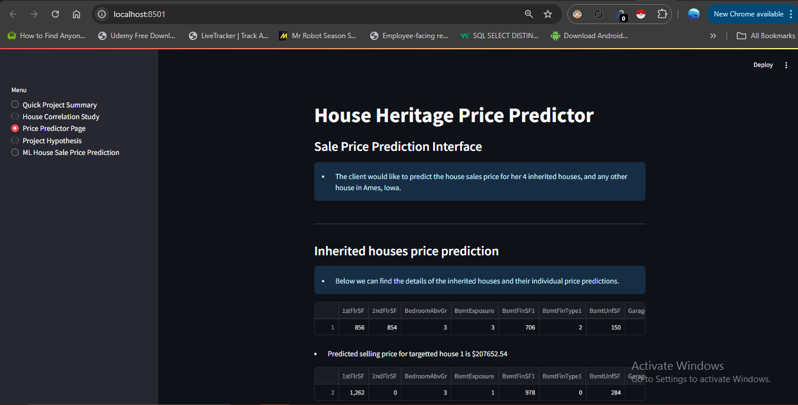
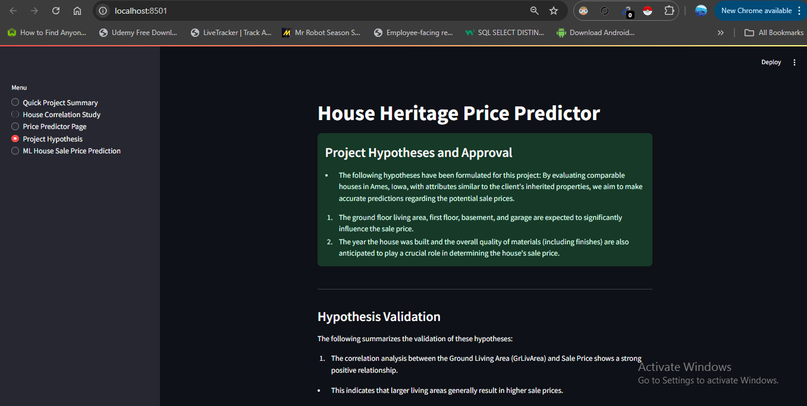
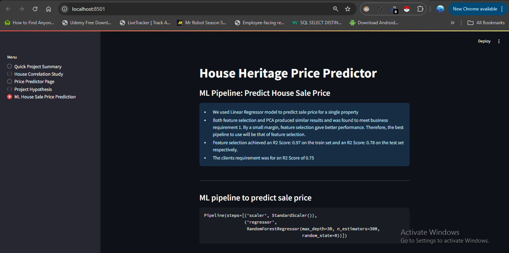

# Ames Housing Price Prediction

## Table of Contents
- [Introduction](#introduction)
- [Business Requirements](#business-requirements)
- [Dataset Content](#dataset-content)
- [Hypotheses for Case Study](#hypotheses-for-case-study)
- [The rationale to map the business requirements to the Data Visualisations and ML tasks](#the-rationale-to-map-the-business-requirements-to-the-data-visualisations-and-ml-tasks)
- [Business Requirement 1](#business-requirement-1)
- [Business Requirement 2](#business-requirement-2)
- [ML Business Case](#ml-business-case)
  - [Predict House Prices in Ames, Iowa](#predict-house-prices-in-ames--iowa)
- [Regression Model](#regression-model)
- [Dashboard Design](#dashboard-design)
- [Unfixed Bugs](#unfixed-bugs)
- [Conclusion](#conclusion)
  - [Summary of Findings](#summary-of-findings)
- [Results](#results)
- [Deployment](#deployment)
  - [Heroku](#heroku)
- [Main Data Analysis and Machine Learning Libraries](#main-data-analysis-and-machine-learning-libraries)
- [Credits and Acknowledgements](#credits-and-acknowledgements)

## Introduction
The goal of this project is to predict house prices in Ames, Iowa, using a machine learning model. The project leverages a dataset from Kaggle and focuses on creating a model that can provide accurate price predictions, as well as a dashboard for visualizing the key factors that affect house prices.

## Business Requirements
- **Requirement 1**: To examine the housing price statistics from the public dataset.
We will conduct a correlation study to investigate the most suitable variables correlating to the sale price. To summarize the data after visualizing these variables vs the sale price.
- **Requirement 2**: Implement a machine learning model that can predict house prices based on a set of input features.Develop a dashboard that allows Lydia to explore how the house attributes correlated with the sale price using data visualizations.

## Dataset Content
The dataset used for this project is sourced from Kaggle and contains the following key features:
|Variable|Meaning|Units|
|:----|:----|:----|
|1stFlrSF|First Floor square feet|334 - 4692|
|2ndFlrSF|Second-floor square feet|0 - 2065|
|BedroomAbvGr|Bedrooms above grade (does NOT include basement bedrooms)|0 - 8|
|BsmtExposure|Refers to walkout or garden level walls|Gd: Good Exposure; Av: Average Exposure; Mn: Minimum Exposure; No: No Exposure; None: No Basement|
|BsmtFinType1|Rating of basement finished area|GLQ: Good Living Quarters; ALQ: Average Living Quarters; BLQ: Below Average Living Quarters; Rec: Average Rec Room; LwQ: Low Quality; Unf: Unfinshed; None: No Basement|
|BsmtFinSF1|Type 1 finished square feet|0 - 5644|
|BsmtUnfSF|Unfinished square feet of basement area|0 - 2336|
|TotalBsmtSF|Total square feet of basement area|0 - 6110|
|GarageArea|Size of garage in square feet|0 - 1418|
|GarageFinish|Interior finish of the garage|Fin: Finished; RFn: Rough Finished; Unf: Unfinished; None: No Garage|
|GarageYrBlt|Year garage was built|1900 - 2010|
|GrLivArea|Above grade (ground) living area square feet|334 - 5642|
|KitchenQual|Kitchen quality|Ex: Excellent; Gd: Good; TA: Typical/Average; Fa: Fair; Po: Poor|
|LotArea| Lot size in square feet|1300 - 215245|
|LotFrontage| Linear feet of street connected to property|21 - 313|
|MasVnrArea|Masonry veneer area in square feet|0 - 1600|
|EnclosedPorch|Enclosed porch area in square feet|0 - 286|
|OpenPorchSF|Open porch area in square feet|0 - 547|
|OverallCond|Rates the overall condition of the house|10: Very Excellent; 9: Excellent; 8: Very Good; 7: Good; 6: Above Average; 5: Average; 4: Below Average; 3: Fair; 2: Poor; 1: Very Poor|
|OverallQual|Rates the overall material and finish of the house|10: Very Excellent; 9: Excellent; 8: Very Good; 7: Good; 6: Above Average; 5: Average; 4: Below Average; 3: Fair; 2: Poor; 1: Very Poor|
|WoodDeckSF|Wood deck area in square feet|0 - 736|
|YearBuilt|Original construction date|1872 - 2010|
|YearRemodAdd|Remodel date (same as construction date if no remodelling or additions)|1950 - 2010|
|SalePrice|Sale Price|34900 - 755000|

## Hypotheses for Case Study
I propsed the following hypothesis:
- Houses with larger living areas (`GrLivArea`, `1stFlrSF`, `2ndFlrSF`) will have higher sale prices.
- Higher `OverallQual` and `OverallCond` scores will lead to higher prices.
- Newer homes (`YearBuilt`, `YearRemodAdd`) are expected to sell for more.

## The rationale to map the business requirements to the Data Visualisations and ML tasks
- **Data Visualizations**: To uncover correlations and trends in the dataset, such as the impact of square footage and overall quality on sale prices.
- **ML Tasks**: Build and evaluate a machine learning model to predict sale prices based on the provided features, automating the pricing process.

## Business Requirement 1
- **Task**: Create data visualizations for key variables like `GrLivArea`, `OverallQual`, `TotalBsmtSF` to show their relationship with house prices.
- **Outcome**: This will give stakeholders a clear understanding of the most impactful variables.

## Business Requirement 2
- **Task**: Build a machine learning regression model to predict house prices based on the available data.
- **Outcome**: Use the model to predict house prices and assist buyers and sellers in making informed decisions.

## ML Business Case
### Predict House Prices in Ames, Iowa
- **Goal**: Build a regression model to predict house prices (`SalePrice`) based on features like area, year built, quality, and condition.

The model success metrics are:
- At least 0.7 for R2 score, on the train and test set (results can be found in Summary Section below).
- The ML model is considered a failure if the model is wrong by more than 30% after 12 months, the prediction need to be consistent over a long period of time.
- The output is defined as a numerical value for price in dollars. The prediction is made on the fly (not in batches).

## Regression Model
- **Pipeline**: 
  - Preprocess data (handling missing values, scaling features).
  - Implement a Random Forest Regressor to predict sale prices.
  - Perform hyperparameter tuning using `RandomizedSearchCV`.
- **Performance Metrics**:
  - R² Score
  - Mean Absolute Error (MAE)
  - Mean Squared Error (MSE)
  - Root Mean Squared Error (RMSE)

## Dashboard Design
The dashboard is designed to provide interactive visualizations of key insights and predictions. It includes:
- **Correlation Heatmap**: Shows the relationship between house features and sale prices.
- **Scatter Plots**: Visualizing the relationship between important features like `GrLivArea`, `OverallQual`, and `TotalBsmtSF` with sale prices.
- **Model Predictions**: Users can input house features and get predicted sale prices.

### Dashboard Images:
<h3>Page 1: Quick Project Summary</h3>

<h3>Page 2: House Correlation Study</h3>

<h3>Page 3: Price Predictor Page</h3>

<h3>Page 4: Project Hypothesis</h3>

<h3>Page 4: ML House Sale Price Prediction</h3>

## Unfixed Bugs
- **Model Performance**: In some cases, the model may underperform on houses with extreme feature values.
- **Future Enhancements**: Tuning the model further and incorporating more data can address this.

## Conclusion
- This project successfully addressed both business requirements: providing insights into the factors that affect house prices and using a machine learning model to predict house prices.
  
### Summary of Findings
- **Key Features**: Features like `GrLivArea`, `OverallQual`, and `TotalBsmtSF` have the strongest correlation with house prices.
- **Model Performance**: The Random Forest Regressor provided reasonable accuracy but could be further improved with additional tuning.

## Results
- **R² Score**: X (Train), X (Test)
- **MAE**: X
- **RMSE**: X
- The model provides reasonably accurate predictions for house prices within the test data.

## Deployment
### Heroku
The final dashboard and model are deployed on Heroku. You can interact with the application to make house price predictions based on input features.
- **Deployment Steps**:
  - Create a Flask/Dash application.
  - Generate a `Procfile` and `requirements.txt`.
  - Push the application to a Heroku environment.

## Main Data Analysis and Machine Learning Libraries
- **Pandas**: For data manipulation and cleaning.
- **NumPy**: For numerical computations.
- **Scikit-learn**: For building the machine learning pipeline and model.
- **Matplotlib & Seaborn**: For creating visualizations.
- **Dash/Plotly**: For building the interactive dashboard.

## Credits and Acknowledgements
- **Dataset**: The dataset used in this project is the Ames Housing Dataset from Kaggle.
- **Libraries**: The project leverages various Python libraries, including Pandas, NumPy, Scikit-learn, and Plotly.
